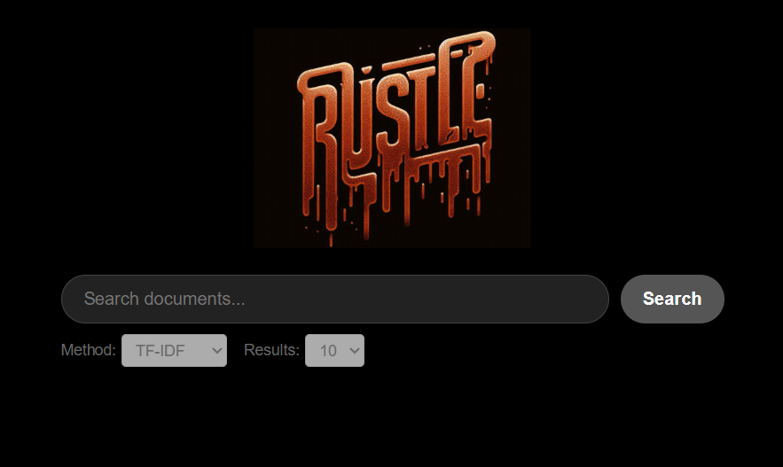

# Wikipedia Search Engine: Vector Space Model vs. LSI (SVD)

A high-performance search engine built on the Simple English Wikipedia dataset, comparing two search algorithms: Vector Space Model (TF-IDF) and Latent Semantic Indexing (SVD).

## Technology Stack

- **Backend:** Rust with Actix-web API
- **Database:** SQLite
- **Frontend:** React with Vite
- **Data Processing:** Python

## Overview

This project explores two fundamental approaches for document indexing and retrieval:
1. **Vector Space Model (TF-IDF)** - Fast, reliable, production-ready
2. **Latent Semantic Indexing (SVD)** - Semantically aware but computationally intensive



## Dataset and Storage Strategy

### SQLite Database

SQLite was selected for this project because of:
- **Compatibility:** Works seamlessly with Rust backend and React frontend
- **Simplicity:** No separate server process required  
- **Performance:** Fast local data access suitable for offline deployments


### Data Pipeline

**Source:** [Wikimedia Dumps (Simple English)](https://dumps.wikimedia.org/enwiki/latest/)

**Processing:**
- XML Dump → TXT Files → SQLite Database
- Parser: [WikiExtractor](https://github.com/attardi/wikiextractor) (modified version)

**Database Population:**

```python
import sqlite3
import re
import glob

def parse_file(file_path):
    docs = []
    with open(file_path, 'r', encoding='utf-8') as file:
        content = file.read()
        pattern = r'<doc id="(\d+)" url="(https?://[^"]+)" title="([^"]+)">([^<]+)<\/doc>'
        matches = re.findall(pattern, content)
        for match in matches:
            docs.append((match[0], match[1], match[2], match[3]))
    return docs

def create_db_and_insert_data(docs):
    conn = sqlite3.connect('articles.db')
    cursor = conn.cursor()
    cursor.execute('''
        CREATE TABLE IF NOT EXISTS articles (
            id INTEGER PRIMARY KEY,
            title TEXT,
            url TEXT,
            text TEXT
        )
    ''')
    cursor.executemany('INSERT INTO articles (id, title, url, text) VALUES (?, ?, ?, ?)', docs)
    conn.commit()
    conn.close()
```

### Alternative Approach: Wikipedia API

An asynchronous Python script for fetching random articles was also explored, but proved slower than parsing the dump directly.

### Data Cleaning

Initial ingestion resulted in ~370,000 documents. During SVD calculation, anomalies from extremely short descriptions were detected.

**Action taken:** Removed articles shorter than 150 characters

**Final document count:** 223,412

```sql
DELETE FROM articles WHERE length(text) < 150;
```

---

## Core Implementation (Rust)


The search engine logic is implemented in Rust for memory safety and performance.

### Text Normalization

- **Stop Words:** Removal of common non-informative words (the, is, at, etc.)
- **Porter Stemming Algorithm:** Reduces words to their root forms by removing morphological endings

### Search Algorithm: Vector Space Model (TF-IDF)

The system builds a Term-Document Matrix using a sparse data structure with three key components:

- **TF (Term Frequency):** How often a word appears in a document
- **IDF (Inverse Document Frequency):** Weights to reduce the importance of common words across the corpus
- **Similarity Metric:** Cosine Similarity

---

## TF-IDF Results

### Key Findings

- **Popular Phrases:** Score is inversely proportional to phrase length
- **Rare Phrases:** Generally lower scores; search time depends heavily on phrase length  
- **Average Query Time:** 0.20s - 0.25s

### Impact of IDF Weighting

Comparison of search results with and without IDF:
- For short queries, the difference is negligible
- As query length increases, results diverge significantly, demonstrating IDF's necessity for complex queries

---

## Approach 2: Latent Semantic Indexing (SVD)

This approach uses Singular Value Decomposition (SVD) to identify semantic relationships between terms.

### Implementation Details

- **Algorithm:** Golub-Kahan-Lanczos algorithm for sparse matrices
- **Optimization:** Re-orthogonalization added for numerical stability (Bidiagonalization)
- **Language:** Custom Rust implementation (no mature sparse SVD library in crate ecosystem)

### Results and Challenges

- **Computation Time:** SVD calculation for rank k=350 with 1000 iterations took approximately 3 days
- **Accuracy Issues:** Results for k=350 showed significant noise, likely due to approximation errors or numerical precision limits
- **Optimization:** Limited rank to k ≥ 100 to keep search times reasonable

---

## Frontend & API

- **API:** Implemented using Actix-web (Rust)
- **Frontend:** Built with React and Vite

---

## Conclusion

The **Vector Space Model (TF-IDF)** provided the best balance of performance and accuracy, with query times under 250ms.

The **SVD** approach, while theoretically powerful for capturing semantic relationships, proved difficult to implement efficiently in Rust without external linear algebra bindings (LAPACK), resulting in high computational costs and stability issues.